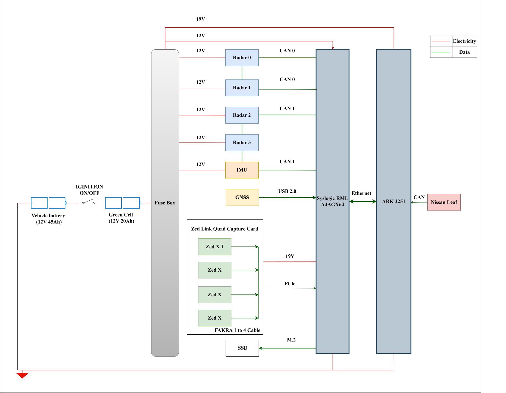
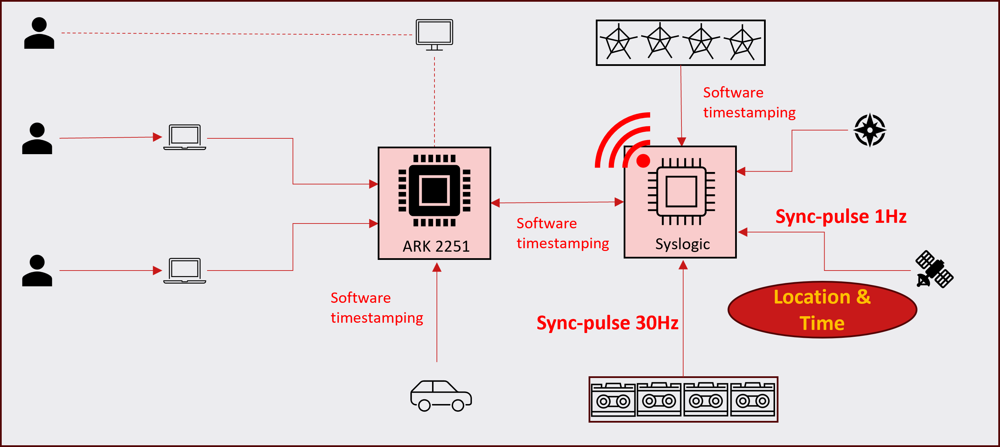
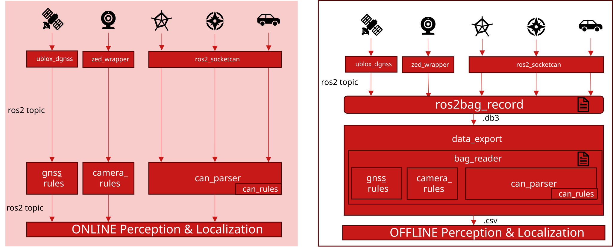

# Omni Onboard Platform

**A Distributed Heterogeneous Computing Platform for Real-Time Omnidirectional Perception and Ego-State Estimation**

Omni Onboard Platform is the main integration and documentation repository for
an onboard ROS 2 system installed on a 2012 Nissan LEAF. The platform combines
an x86 vehicle computer with an NVIDIA Jetson AGX Orin sensor computer and
connects cameras, radars, GNSS receivers, an IMU, and vehicle CAN data in one
distributed system.

This repository is the entry point to the complete project. The individual
hardware drivers remain independently versioned in sibling ROS 2 workspaces.

## System overview

The platform divides work between two onboard computers:

| Computer | Architecture | Primary role |
|---|---|---|
| Advantech ARK-2251 | x86-64 | Nissan LEAF CAN acquisition and vehicle-state signals |
| Jetson AGX Orin 64 GB on the Syslogic platform | ARM64 with NVIDIA GPU | Camera, radar, GNSS, and IMU acquisition and processing |

Both computers run ROS 2 Humble. ROS messages are exchanged through CycloneDDS
over the onboard Ethernet network.

```text
Nissan LEAF CAN
      │
      ▼
Advantech ARK-2251 (x86-64)
      │
      │ ROS 2 / CycloneDDS over Ethernet
      │
      ▼
Jetson AGX Orin (ARM64 + GPU)
      ├── 4 × ZED X stereo cameras
      ├── 4 × Continental SRR308 radars
      ├── 2 × u-blox RTK GNSS receivers
      └── 1 × Continental SC13S IMU
```



## Communication and time synchronization

CycloneDDS provides ROS 2 discovery and data transport between the x86 and
ARM64 computers. The supplied [`cyclonedds.xml`](./cyclonedds.xml) uses ROS
domain `0`, disables multicast, selects the Jetson/Syslogic-side `lan2`
interface, and configures the ARK-2251 at `192.168.100.2` as a discovery peer.
Interface names and peer addresses are deployment-specific and must be checked
on each computer.

Clock synchronization is handled separately from DDS:

1. GNSS supplies UTC through NMEA and PPS.
2. Chrony disciplines the Jetson/Syslogic system clock.
3. The Jetson/Syslogic computer acts as the PTP master.
4. The ARK-2251 acts as the PTP slave.
5. `ptp4l` synchronizes the network hardware clocks and `phc2sys` synchronizes
   the Linux system clock.

This allows sensor and vehicle messages produced on different computers to use
a common time base. See the
[PTP configuration guide](./docs/wiki/ptp_multi_cameras_config.md) for the
current setup.



## Hardware

| Category | Hardware | Quantity | Documentation |
|---|---|---:|---|
| Vehicle | Nissan LEAF MY2012 | 1 | [Nissan LEAF OBD-II manual](https://leaf-obd.readthedocs.io/en/latest/) |
| Compute | Jetson AGX Orin 64 GB | 1 | [Board specification](./docs/datasheets/Computer_Jetson_AGX_Orin_Module_Carrier_Board_Specification.pdf) |
| Compute | Advantech ARK-2251 | 1 | [Datasheet](./docs/datasheets/Computer_ARK_2251_Datasheet.pdf) |
| Vision | ZED X stereo camera with integrated IMU | 4 | [Datasheet](./docs/datasheets/Sensor_ZED_X_Datasheet.pdf) |
| Radar | Continental SRR308-21 short-range radar | 4 | [Datasheet](./docs/datasheets/Sensor_SRR308_Datasheet.pdf)<br>[Interface specification](./docs/datasheets/Sensor_ARS_40X_SRR308_Interface.pdf)<br>[Short description](./docs/datasheets/Sensor_SRR308_Short_Description.pdf) |
| Inertial | Continental SC13S six-degree-of-freedom IMU | 1 | [Datasheet](./docs/datasheets/Sensor_IMU_SC13S.pdf) |
| Positioning and timing | u-blox ZED-F9 RTK GNSS | 2 | [Syslogic GNSS guide](./docs/datasheets/Sensor_GNSS_%20accessing_GNSS_on_Syslogic_systems.pdf) |

## Software components

The source code is organized as multiple sibling ROS 2 workspaces under the
local project root, `/mnt/nvme/Projects`.

| Workspace and package | Target | Responsibility | Repository |
|---|---|---|---|
| `nissan_ros2_ws/src/nissan_leaf_can_driver_ros2` | ARK-2251 | SocketCAN bridge, Nissan CAN decoding, and vehicle dynamics messages | [nissan_leaf_can_driver_ros2](https://github.com/boyuzhao-hub/nissan_leaf_can_driver_ros2) |
| `nissan_ros2_ws/src/vehicle_description` | Integration | Nissan URDF, sensor frames, and robot-state publisher | Currently stored as a local package |
| `imu_ros2_ws/src/sc13s_imu_driver` | Jetson | SC13S CAN decoding, raw IMU data, raw CAN frames, and diagnostics | [sc13s_imu_driver](https://github.com/boyuzhao-hub/sc13s_imu_driver) |
| `radar_ros2_ws/src/srr308_radar_driver` | Jetson | Four-radar CAN acquisition, configuration, visualization, and tracking components | [srr308_radar_driver](https://github.com/boyuzhao-hub/srr308_radar_driver) |
| `ublox_ros2_ws/src/ublox_dgnss_ros2` | Jetson | Dual-GNSS USB acquisition, moving-base configuration, RTK data, and high-precision fixes | [ublox_dgnss_ros2](https://github.com/boyuzhao-hub/ublox_dgnss_ros2) |
| `zed_ros2_ws/src/zed-ros2-wrapper` | Jetson | ZED X camera acquisition and custom multi-camera launch/URDF support | [zed-ros2-wrapper](https://github.com/boyuzhao-hub/zed-ros2-wrapper) |
| `zed_ros2_ws/src/zed-ros2-description` | Jetson | Upstream ZED camera descriptions | [zed-ros2-description](https://github.com/stereolabs/zed-ros2-description) |
| `zed_ros2_ws/src/zed-ros2-examples` | Jetson | Upstream ZED examples and development references | [zed-ros2-examples](https://github.com/stereolabs/zed-ros2-examples) |
| `omni_onboard_platform/rosbag_recorder` | Integration | Passive, host-backed recording of the selected GNSS, radar, and ZED topics | Local infrastructure component |



## Current project layout

```text
/mnt/nvme/Projects/
├── omni_onboard_platform/                 # Main entry repository
│   ├── README.md
│   ├── cyclonedds.xml                     # Inter-computer DDS configuration
│   ├── docker-compose.yml                 # Current integration services
│   ├── rosbag_recorder/                   # Persistent rosbag infrastructure
│   └── docs/
│       ├── assets/                        # Architecture and protocol diagrams
│       ├── datasheets/                    # Hardware specifications and manuals
│       └── wiki/                          # Project knowledge base
├── nissan_ros2_ws/
│   └── src/
│       ├── nissan_leaf_can_driver_ros2/   # Vehicle CAN stack
│       └── vehicle_description/           # Vehicle URDF and static frames
├── imu_ros2_ws/
│   └── src/sc13s_imu_driver/
├── radar_ros2_ws/
│   └── src/srr308_radar_driver/
├── ublox_ros2_ws/
│   └── src/ublox_dgnss_ros2/
├── rosbag_data/                            # Host-backed recorded datasets
└── zed_ros2_ws/
    └── src/
        ├── zed-ros2-description/
        ├── zed-ros2-examples/
        └── zed-ros2-wrapper/
```

The workspaces are siblings of this repository; they are not contained in an
`omni_onboard_platform/src` monorepo.

## Deployment status

The current [`docker-compose.yml`](./docker-compose.yml) contains two services:

- `core_state`: builds and launches `vehicle_description` and
  `robot_state_publisher`.
- `sc13s_imu`: builds and launches the SC13S IMU driver on host SocketCAN
  interface `can1`.

The standalone [`rosbag_recorder`](./rosbag_recorder/README.md) container is
deployed separately from Compose. It remains idle until a recording is started
with `docker exec`, and bind-mounts `/mnt/nvme/Projects/rosbag_data` so bags
survive container replacement.

Radar, GNSS, ZED camera, and Nissan CAN services are maintained in their
component workspaces but have not yet been added to the integration Compose
file. Likewise, the repository currently provides the measurements required
for ego-state estimation, but a system-level fusion estimator is not yet part
of the integration repository.

> **Compose path migration:** `docker-compose.yml` was moved from
> `/mnt/nvme/Projects` into this repository. Its workspace references still use
> the former relative paths. Before launching from `omni_onboard_platform`,
> change component references such as `./imu_ros2_ws/...` to
> `../imu_ros2_ws/...`; the `core_state` image also needs the parent project
> directory as its Docker build context because it copies both
> `vehicle_description` and `zed-ros2-description`.

## Prerequisites

### Both computers

- Ubuntu 22.04 LTS
- ROS 2 Humble
- `rmw_cyclonedds_cpp`
- An Ethernet connection configured for ROS 2 and PTP
- LinuxPTP and Chrony for clock synchronization

### Jetson sensor computer

- JetPack 6.2.2
- CUDA 12.6
- A compatible ZED SDK
- SocketCAN interfaces configured for the radar and SC13S buses
- USB access and udev rules for the GNSS receivers

### ARK-2251 vehicle computer

- A configured SocketCAN interface for the Nissan LEAF CAN bus
- Network access to the Jetson/Syslogic CycloneDDS participant

## Knowledge base

### Sensors, CAN, and synchronization

- [CAN frame structure](./docs/wiki/can_frame_structure.md)
- [Understanding DBC files](./docs/wiki/understand_dbc_file.md)
- [RTK GNSS and u-blox configuration](./docs/wiki/rtk_gnss.md)
- [PTP clock synchronization](./docs/wiki/ptp_multi_cameras_config.md)
- [Continental SRR308 configuration handbook](./docs/wiki/srr308_configuration_handbook.md)

### ROS 2 and deployment

- [ROS 2 message serialization, RMW, and DDS](./docs/wiki/ros2_message_serialization.md)
- [Writing a URDF](./docs/wiki/write_a_urdf.md)
- [Writing a Dockerfile](./docs/wiki/write_a_dockerfile.md)

## Planned integration work

- Add a repository manifest for reproducible multi-repository checkout.
- Move or version `vehicle_description` as an integration-owned package.
- Correct the Compose build contexts after relocation.
- Add radar, GNSS, camera, and Nissan CAN services to Compose.
- Add health monitoring and a unified system bring-up procedure.
- Integrate and validate the ego-state fusion estimator.
- Measure end-to-end rates, latency, timestamp alignment, and resource usage to
  verify the real-time system requirements.
